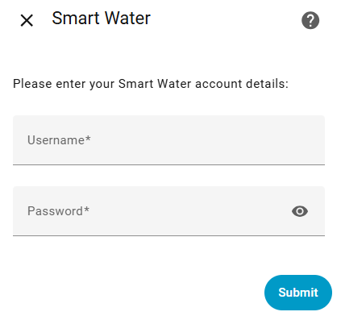
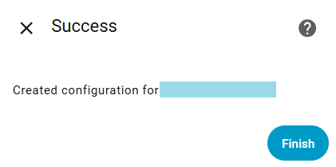
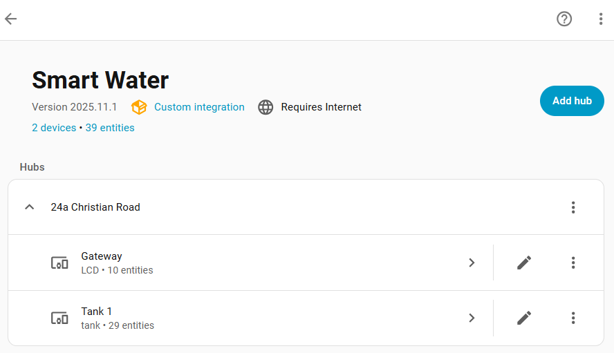
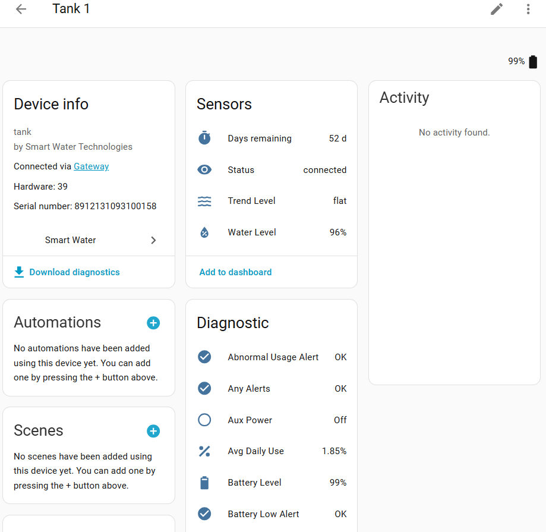
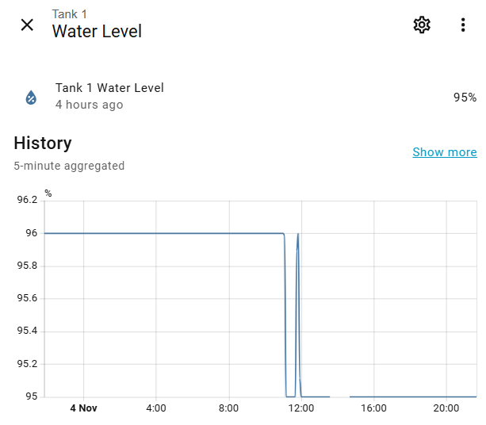

[](https://github.com/ankohanse/hass-smart-water)
[](https://github.com/custom-components/hacs)
[](https://github.com/ankohanse/hass-smart-water)<br/>
[](https://github.com/ankohanse/hass-smart-water/blob/main/LICENSE)
[](https://www.buymeacoffee.com/ankohanse)


# Smart Water

[Home Assistant](https://home-assistant.io/) custom component for retrieving sensor information from Smart Water branded devices.
This component connects to the remote Smart Water Technology servers and automatically determines which gateways, tanks and pumps are available there.

The custom component is compatible with SW900 devices (Desk Mount Wifi LCD, Wall Mount WiFi LCD, Tank Level Sender and Wireless Pump Controllers).

Legacy SW800 devices are not supported as these do not have WiFi/internet connectivity.


# Prerequisites
This library depends on the backend servers for the Smart Water app to retrieve the device information from. 

Before using this library, the Smart Water app must have been used to link the desktop or wall-mount WiFi LCD to the Smart Water services.


# Installation

## HACS
This custom integration is waiting to be included into the HACS default integrations.
Until that time, you can add it as a HACS custom repository:
1. In the HACS page, press the three dots at the top right corner.
2. Select 'Custom Repositories'
3. Enter repository "https://github.com/ankohanse/hass-smart-water" (with the quotes seems to work better)
4. Select category 'integration' and press 'Add'
5. Restart Home Assistant.
6. Follow the UI based [Configuration](#configuration)

## Manual install
1. Under the `<config directory>/custom_components/` directory create a directory called `smartwwater`. 
Copying all files in `/custom_components/smartwater/` folder from this repo into the new `<config directory>/custom_components/smartwater/` directory you just created.

    This is how your custom_components directory should look like:

    ```bash
    custom_components
    ├── smartwater
    │   ├── translations
    │   │   └── en.json
    │   ├── __init__.py
    │   ├── api.py
    │   ├── binary_sensor.py
    │   ├── config_flow.py
    │   ├── const.py
    │   ├── coordinator.py
    │   ├── diagnostics.py
    │   ├── entity_base.py
    │   ├── entity_helper.py
    │   ├── manifest.json
    │   ├── sensor.py
    │   ├── store.py
    │   └── strings.json  
    ```

2. Restart Home Assistant.
3. Follow the UI based [Configuration](#configuration)

# Configuration
To start the setup of this custom integration:
- go to Home Assistant's Integration Dashboard
- Add Integration
- Search for 'Smart Water'
- Follow the prompts in the configuration step

## Step 1 - Connection details
The following properties are required to connect to the Smart Water servers:
- Username: email address as registered with Smart Water
- Password: password associated with the username
  


## Step 2 - Finish
The integration will try to connect to the Smart Water servers to retrieven the user's profile.
If this succeeds, it will create entities for the found gateways, tanks and pumps.



## Devices
After succcessful setup, all devices from the Smart Water profile should show up in a list.



On the individual device pages, the hardware related device information is displayed, together with sensors typically grouped into main entity sensors, controls and diagnostics.

Any sensors that you do not need can be manually disabled using the Home Assistant integration pages.




## Sensors
Sensors are registered to each device as `sensor.{device_id}_{sensor_name}` with an easy to read friendly name of `sensor_name`. 
  



# Troubleshooting
Please set your logging for the this custom component to debug during initial setup phase. If everything works well, you are safe to remove the debug logging:

```yaml
logger:
  default: warn
  logs:
    custom_components.smartwater: debug
```

